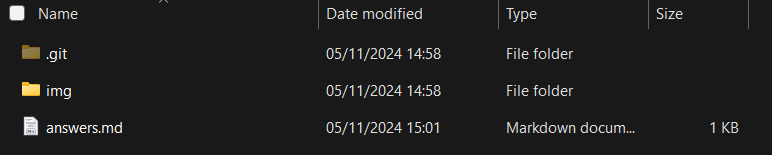
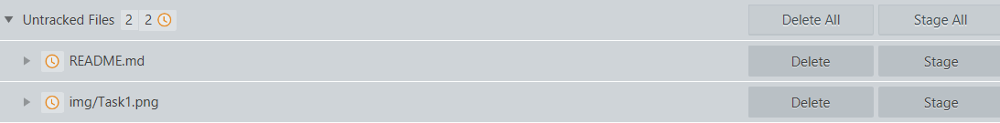
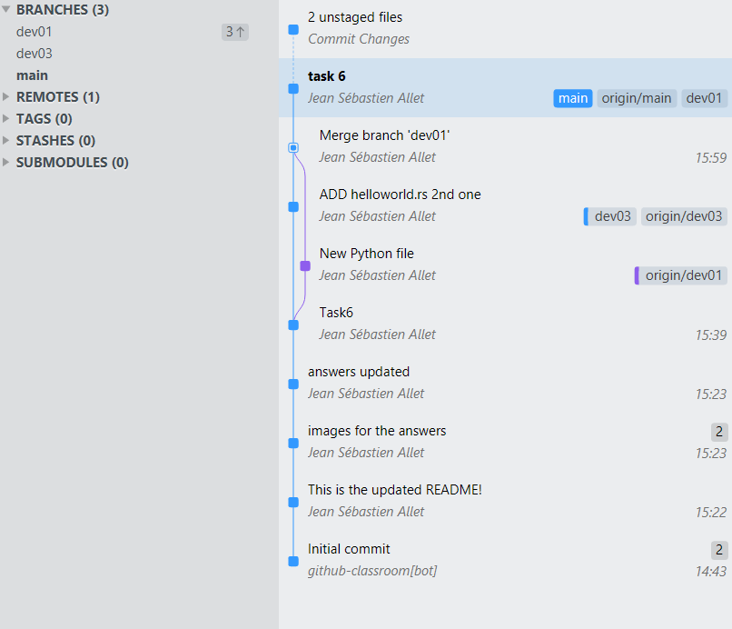

# Answers of Jean Sébastien Allet JSA-HEVS

## Basics
### Task 1
We find this:

- .git folder: contains all the information that is necessary for your project in version control and all the information about commits, remote repository address, etc. 
- img folder: contains all images
- answers.md: this document

### Task 2

We can see a new "Untracked Files", because we have a new file.

### Task 3
Now we have a "staged file" with our ReadMe in.

### Task 4
I can stage the README with the newly added information, but the staged one didn't change.

### Task 5
- The first lign of the commit is the commit hash, its unique signature.
- HEAD refers to the currently checked-out branch's latest commit
- main refers to the main branch
- After the () -> Shows where we are at at the moment

### Task 6
When i checked out the first commit, the files in my repo folder where like in the very beginning. And then when i checked out my last main changes, the files in my repo folder where there with my lastest changes.

## Gitgraph
Here is my graph:

I made a few mistakes along the way, thats why i have dev03, and i could name my commits better.

### Task 7

    1. Branch Name
    2. Commit Hash
    3. Merge Message
    4. Author
    5. Tag/Version
    6. Final commit
    7. New branch from point 8
    8. Main branch with checked out branch
    9. New branch from original
    10. Original commit